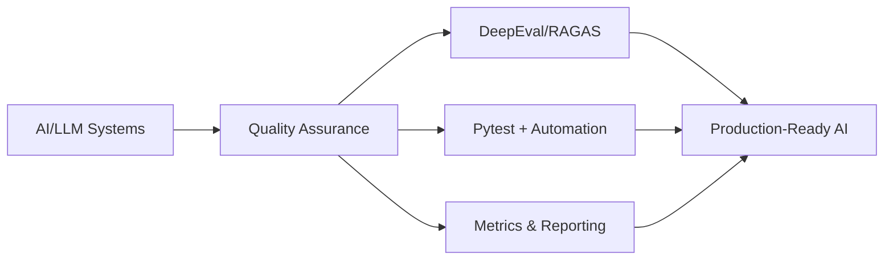

<div align="center">

[](https://git.io/typing-svg)


</div>

---

##  Привет! Я Рамиль

> **Quality Assurance Engineer** специализирующийся на тестировании AI/LLM систем, RAG-пайплайнов и автоматизации QA процессов

**Фокус:** Превращаю субъективные оценки качества AI в объективные метрики и автоматизированные тесты  
**Миссия:** Обеспечиваю что AI-системы работают не просто корректно, а приносят измеримую бизнес-ценность  
**В поиске:** Возможностей для работы над инновационными AI/ML проектами в роли QA/SDET Engineer

<br>

<div align="center">

###  Чем я занимаюсь



</div>

---

##  Технологический стек

<details open>
<summary><b>Core Skills</b></summary>
<br>

**LLM Testing & Evaluation:**
```python
• DeepEval          # Answer Relevancy, Faithfulness, Toxicity, Bias
• RAGAS             # Context Precision/Recall для RAG-систем
• Custom Metrics    # Keyword Density, Readability, Structure Quality
• Pytest            # Интеграция evaluation в CI/CD
```

**Automation & Development:**


**AI/LLM Integration:**


**Data & Databases:**


**DevOps & Tools:**


</details>

---

##  Featured Projects

<table>
<tr>
<td width="50%">

### AI Quality Assurance Automation
**Automated QA System для LLM-генерированного контента**

• DeepEval + кастомные SEO метрики  
• Quality Gates (Auto-approve/Review/Reject)  
• Экономия: ~70% editorial time  
• Снижение client complaints на 60%  

**Stack:** `Python` `DeepEval` `Pandas` `Pytest`

[📂 View Details →](https://github.com/RamilQAEng)

</td>
<td width="50%">

### LLM Evaluation Framework
**Сравнительный анализ DeepEval vs RAGAS**

• Benchmark на 50+ примерах  
• Метрики: Speed, Accuracy, Cost  
• Data-driven рекомендации  
• Воспроизводимая методология  

**Stack:** `DeepEval` `RAGAS` `Jupyter` `Matplotlib`

[📂 View Research →](https://github.com/RamilQAEng)

</td>
</tr>

<tr>
<td width="50%">

### Telegram Bot для AI Test Cases
**Генератор тест-кейсов с LLM интеграцией**

• Интеграция SBER GigaChat API  
• Автоматическая генерация test cases  
• Custom промпты для разных сценариев  
• Export в Excel/CSV  

**Stack:** `Python` `Telegram Bot API` `GigaChat`

[📂 View Code →](https://github.com/RamilQAEng/Chat_bot_test)

</td>
<td width="50%">

### Web Scraper + Proxy Rotation
**Парсер статичных сайтов с поддержкой прокси**

• Конфигурируемые теги через YAML  
• Ротация прокси для масштабирования  
• Error handling + retry logic  
• Data validation + export  

**Stack:** `Python` `BeautifulSoup` `Requests`

[📂 View Code →](https://github.com/RamilQAEng/parsing)

</td>
</tr>
</table>

---

##  GitHub Analytics

<div align="center">
  
[](https://git.io/streak-stats)

</div>

---

## Экспертиза в AI QA

<table>
<tr>
<td width="33%" align="center">

**LLM Evaluation**

DeepEval, RAGAS, LangChain  
Custom Metrics Design  
A/B Testing Methodologies
</td>
<td width="33%" align="center">

**Test Automation**

Pytest Frameworks  
CI/CD Integration  
Regression Testing
</td>
<td width="33%" align="center">

**Quality Metrics**

Performance Monitoring  
Business Impact Analysis  
ROI Calculations
</td>
</tr>
</table>

---

##  Что я изучаю прямо сейчас

```python
current_focus = {
    "advanced_rag": ["REFRAG methodology", "Hybrid search", "Reranking"],
    "ai_security": ["Prompt injection defense", "Jailbreak detection", "PII leakage"],
    "mlops": ["Model monitoring", "Drift detection", "A/B experiment frameworks"],
    "agentic_systems": ["Multi-agent orchestration", "Claude-flow", "LangGraph"]
}
```

<details>
<summary><b>Recent Learning Highlights</b></summary>
<br>

**REFRAG** - Cost-efficient RAG optimization methodology  
**OWASP LLM Top 10** - Security testing для AI систем  
**Statistical Testing** - Корректное измерение A/B тестов  
**System Design** - Архитектура production-ready AI систем  

</details>

---

##  Мой подход к QA

> **"От субъективного к измеримому, от ручного к автоматизированному"**

```diff
- Редактор вручную проверяет 1000 статей (80 часов работы)
+ Automated QA System проверяет 1000 статей (30 минут)

- "Статья хорошая" (субъективно, невоспроизводимо)
+ Relevancy: 0.87, Toxicity: 0.02, Keyword Coverage: 95% (объективно, воспроизводимо)

- Обнаруживаем проблемы когда клиенты жалуются (поздно, дорого)
+ Quality Gates блокируют проблемный контент до публикации (рано, дешево)
```

**Результат:** Экономия времени + Улучшение качества + Защита репутации = **Измеримая бизнес-ценность**

---

##  Контакты

<div align="center">

[](mailto:ramill9754@gmail.com)
[](https://t.me/Rambajo)

**Открыт для обсуждения:** AI QA позиций, контрактных проектов, консультаций по LLM testing

</div>

---

## Roadmap 2026

- [x] Написать первый парсер с proxy rotation
- [x] Создать Telegram бот с LLM интеграцией
- [x] Освоить DeepEval и RAGAS для LLM evaluation
- [ ] Перейти на 100% автоматизированный QA workflow
- [ ] Интегрировать LLM evaluation в 10+ production проектов
- [x] Публикация статей про AI QA в русскоязычном tech community

---

<div align="center">

###  Philosophy

*"Хорошие QA инженеры находят баги. Отличные QA инженеры предотвращают баги.  
**AI QA инженеры** превращают качество в измеримую бизнес-метрику."*

---

</div>

---

<div align="center">

</div>
